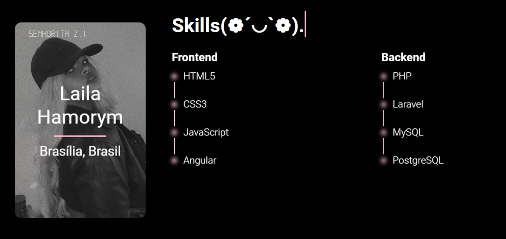

<h1 align="center">3D FLIP CARD</h1>

[🔗CLIQUE AQUI PARA ACESSAR😍](https://lailaamorim.github.io/3D-Flip-Card/)

## 💻 Description
(^///^)

3D Flip Card é um efeito construído com CSS. Este efeito faz com que a carta ou elemento gire.

3D Flip Card is an effect built with CSS. This effect causes the card or element to rotate.

## 📖 About 3D Flip Card
╰(*°▽°*)╯

O objetivo de usar esse efeito no cartão foi aprender mais sobre animações 3D e transições com CSS.
     
The purpose of using this effect on the card was to learn more about 3D animations and transitions with CSS.

     

## 🧑‍🚀🚀 Contribution
ಥ_ಥ

Solicitações de pull são bem-vindas. Para mudanças importantes, abra uma pergunta de competição primeiro sobre o que você gostaria de mudar.

Pull requests are welcome. For major changes, open a competition question first what you would like to change.

## 👩‍💻 Author
Laila Hamorym

A programação se tornou mais do que apenas uma habilidade para mim, transformando-se em uma verdadeira paixão que me impulsiona a cada dia. Desde os primeiros passos nesse universo fascinante, me encantei com a capacidade de criar soluções inovadoras e dar vida às minhas ideias por meio de códigos.

Ao longo dessa jornada, tive a oportunidade de vivenciar os desafios e as recompensas que a programação proporciona. Cada problema solucionado, cada projeto concluído com sucesso, me motiva a buscar novos conhecimentos e aprimorar minhas habilidades. 

inspired by the developer Leticia Dias

## 😊Contato
lailaamorimsant@gmail.com
